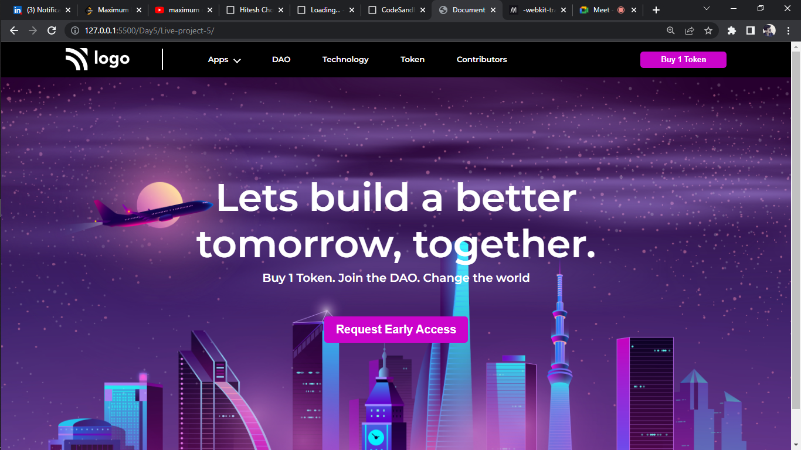

# Day 5 Live Project -5

## Technology used?

    - HTML (list, buttons, anchor, img etc. )
    - CSS (flex, positions, color and other css properties)

## Time Duration to build this Project

    - 2 hours

## How to run ?

    - Download zip file from github or use git to clone project in your computer system.
    - Open download folder and go to index.html file
    - Double click on index.html icon.

## Find me on

 [Dikshit Bhardwaj](https://www.linkedin.com/in/dikshit-bhardwaj-8678b2191/)
